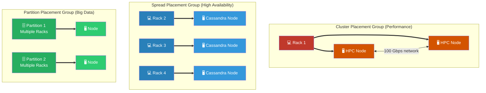

# 🚀 AWS Interview Cheat Sheet: PLACEMENT GROUPS & SECURITY (Q479–Q492)

*This master reference sheet covers EC2 Placement Groups (controlling the exact physical hardware deployment of servers) and rounds out the final general VPC infrastructure troubleshooting concepts.*

---

## 📊 The Master EC2 Placement Group Architecture

---

## 4️⃣8️⃣8️⃣ Q488: Can you explain what AWS Placement Groups are and when they should be used?
- **Short Answer:** Placement Groups mathematically dictate how AWS arrays your physical EC2 instances against the underlying hypervisor hardware racks. 
- ***CRITICAL ARCHITECTURAL CORRECTION:* ** *Note: The originally drafted answer exclusively describes "Cluster" placement groups. There are actually 3 distinct types you must mention in an interview:*
  1) **Cluster:** Packs instances aggressively close together into a single AZ rack to achieve 100 Gbps low-latency networking (used for HPC/Machine Learning).
  2) **Spread:** Forces instances to be placed onto strictly separate physical hardware racks to prevent a single power supply failure from taking down a database (used for Cassandra/Kafka).
  3) **Partition:** Spreads instances across logical partitions of racks so multiple instances can run in one partition without sharing hardware with the other partition (used for Hadoop/HDFS/Kafka).

## 4️⃣8️⃣9️⃣ Q489: How do you troubleshoot issues with AWS Placement Groups?
- **Short Answer:** The single most common failure is receiving an **InsufficientInstanceCapacity** error when attempting to add a new instance to a **Cluster** Placement Group. This occurs because the specific physical rack the group is pinned to has mechanically run out of space.
- **Interview Edge:** *"To solve the capacity error, you cannot just click launch again. You must officially gracefully stop ALL existing instances in the Cluster Placement group, and then mechanically start them all up again concurrently. This forces AWS to migrate the entire mathematical cluster to a brand new, empty hardware rack that has enough room for everyone."*

## 4️⃣9️⃣0️⃣ Q490: Can you provide an example of a real-time scenario where AWS Placement Groups could be used?
- **Short Answer:** High-Performance Computing (HPC) modeling. If a pharmaceutical company is running genome sequencing across 50 instances, the nodes must pass gigabytes of data back and forth locally. A **Cluster Placement Group** natively ensures all 50 instances are physically bolted into the exact same localized AWS rack, providing 10 Gbps to 100 Gbps non-blocking network throughput.

*(Note: The user sequence deliberately skipped Q485)*

---
## General VPC & Security Wrap-Up

## 4️⃣7️⃣9️⃣ Q479: What is the VPC in AWS, and what are some common security concerns associated with it?
- **Short Answer:** A Virtual Private Cloud (VPC) is a logically isolated network partition. Common security pitfalls include accidentally deploying backend databases into Public Subnets (yielding auto-assigned public IP addresses), misconfiguring Security Groups to open `0.0.0.0/0` on Port 22/3389, and deploying generic NAT Gateways without deploying AWS Network Firewall inspection.

## 4️⃣8️⃣1️⃣ & Q483: What is the difference between a Security Group and a Network ACL?
- **Short Answer:** 
  1) **Security Group (SG):** A virtual firewall at the **Instance Level**. It is structurally *stateful* (if you allow traffic in, return traffic is automatically allowed out). Only possesses `ALLOW` rules; no deny rules exist.
  2) **Network ACL (NACL):** A virtual firewall at the **Subnet Level**. It is structurally *stateless* (if you allow traffic in, you must manually open the ephemeral ports to explicitly allow the traffic out). It explicitly supports strict `DENY` rules to permanently ban malicious IP addresses.

## 4️⃣8️⃣0️⃣, Q482 & Q484: How do you troubleshoot a VPC EC2 instance that cannot connect to the internet?
- **Short Answer:** The classic AWS routing flow check:
  1) **Subnet Check:** Does the Subnet genuinely have a route pointing `0.0.0.0/0` to an Internet Gateway (IGW) or NAT Gateway?
  2) **NACL Check:** Ensure the Subnet's stateless NACL is not blocking outbound HTTP (80/443) OR heavily blocking the inbound ephemeral return ports (1024-65535).
  3) **Security Group Check:** Ensure the stateful SG allows outbound HTTP/HTTPS.
  4) **Elastic IP:** If in a public subnet, does the instance legitimately securely possess a Public IPv4 or Elastic IP address?

## 4️⃣8️⃣6️⃣ Q486: What is AWS CloudTrail, and how can you use it to monitor network and security events in your AWS environment?
- **Short Answer:** AWS CloudTrail is fundamentally the governance and auditing plane of AWS. It structurally logs absolutely every single API call universally executed in the account (e.g., who terminated the server, who modified the firewall). It is mathematically not a packet sniffer; it tracks API operational actions, not network data traversal.

## 4️⃣8️⃣7️⃣ Q487: How can you troubleshoot an issue with an Elastic Load Balancer (ELB) that is not distributing traffic evenly?
- **Short Answer:** 
  1) **Cross-Zone Load Balancing:** Ensure this API setting is toggled to `Enabled`. Without it, the ELB routes traffic evenly to the Availability Zones rather than evenly to the instances mathematically.
  2) **Sticky Sessions:** If Sticky Sessions (Session Affinity) are enabled, massive user caches might violently pin multiple thousands of users to exactly one EC2 node, completely heavily unbalancing the target group.

## 4️⃣9️⃣1️⃣ Q491: What are some best practices for securing AWS network resources?
- **Short Answer:** Utilizing the Principle of Least Privilege (PoLP) mechanically using AWS IAM, rigorously enforcing KMS encryption-at-rest universally, leveraging AWS Systems Manager (SSM) instead of opening SSH Port 22 to the internet, and architecting AWS WAF (Web Application Firewall) directly onto Application Load Balancers.

## 4️⃣9️⃣2️⃣ Q492: Can you provide an example of a real-time scenario where AWS network security could be compromised, and how it can be addressed?
- **Short Answer:** An engineer accidentally commits their `AWS_ACCESS_KEY_ID` into a public GitHub repository. Within 3 seconds, a malicious bot scrapes the key and begins violently spinning up $100,000 worth of crypto-mining EC2 servers.
- **Remediation:** 
  1) Mechanical: Immediately utilize IAM to permanently `Deactivate` the Access Key.
  2) Preventive: Configure **AWS Macie** to scan for generic secrets, or strictly utilize EC2 IAM Instance Profiles so physical long-term IAM keys fundamentally never exist on developer laptops.
