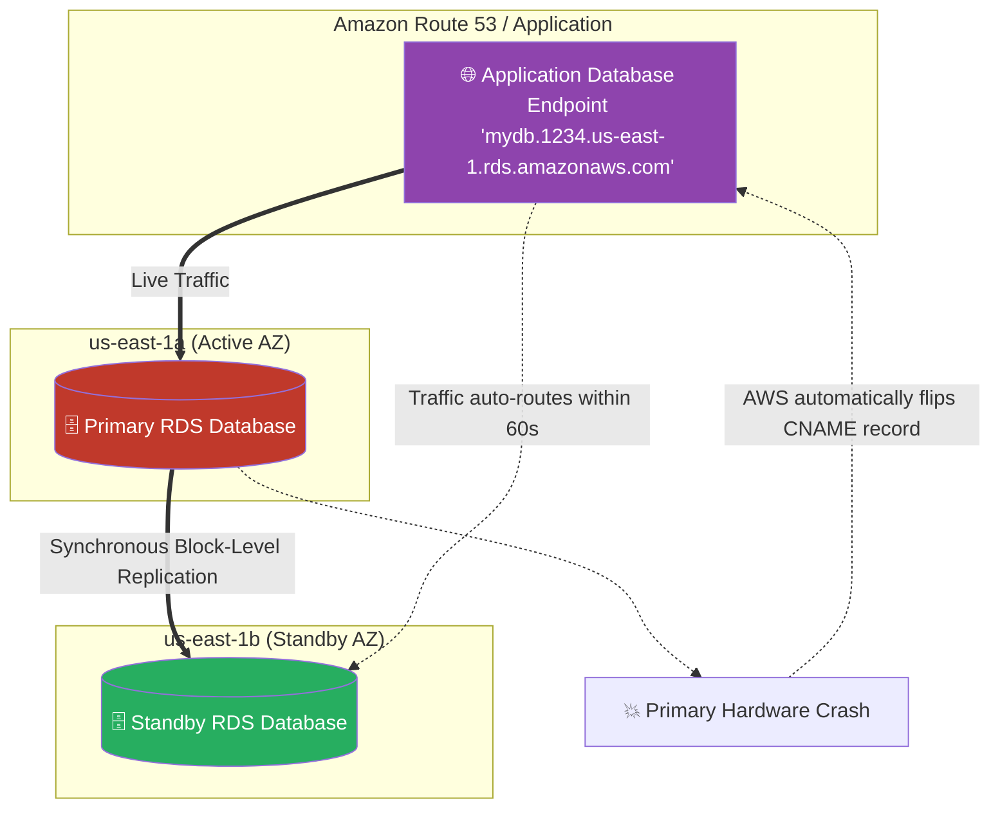

# 🚀 AWS Interview Cheat Sheet: AMAZON RDS (Q540–Q561)

*This master reference sheet marks the beginning of AWS Database Architecture, covering the operational management of the Amazon Relational Database Service (RDS).*

---

## 📊 The Master RDS Multi-AZ Failover Architecture

---

## 5️⃣4️⃣0️⃣ & Q541 & Q542: What is Amazon RDS, and what are its benefits and supported engines?
- **Short Answer:** Amazon Relational Database Service (RDS) is a fully managed DBaaS (Database-as-a-Service). Instead of manually installing SQL on an EC2 instance, AWS provisions the hardware, installs the OS, installs the database engine, and fully manages automated patching and backups.
- **Engines Supported (6):** Amazon Aurora, PostgreSQL, MySQL, MariaDB, Oracle, and Microsoft SQL Server.

## 5️⃣4️⃣6️⃣ Q546: How does Amazon RDS ensure high availability of databases?
- **Short Answer:** Utilizing the **Multi-AZ Deployment** architecture.
- **Interview Edge:** *"To prove senior architectural knowledge, you must explain that Multi-AZ replication is strictly **Synchronous Block-Level Replication**. When the application writes data to the Primary DB, the Primary database mathematically pauses, waits for the Standby DB in the second AZ to independently confirm it also wrote the data to its physical hard drive, and only then returns a 'Success' to the user. If the Primary dies, AWS organically executes a DNS CNAME flip to instantaneously promote the Standby to Primary."*

## 5️⃣4️⃣4️⃣ Q544: Can you scale the size of an Amazon RDS instance?
- **Short Answer:** *CRITICAL ARCHITECTURAL CORRECTION:* **Yes, but not the way the drafted answer implies.**
- **Interview Edge:** *"The drafted answer fatally claims RDS natively uses 'AWS Auto Scaling' to scale the size up or down. **This is fundamentally false.** You categorically cannot auto-scale the compute hardware (e.g., automatically bumping `db.m5.large` to `db.m5.xlarge`). That requires manual architect intervention and incurs a few minutes of downtime. What you CAN dynamically auto-scale is the **Storage** (EBS disk size). RDS Auto Storage Scaling organically grows the physical hard drive dynamically when free space drops below 10% without stopping the database."*

## 5️⃣4️⃣3️⃣ Q543: How does Amazon RDS handle backups?
- **Short Answer:** 
  1) **Automated Backups:** AWS mechanically takes a full snapshot every day during your defined maintenance window, and subsequently captures all Transaction Logs every 5 minutes and pushes them to Amazon S3.
  2) **Point-in-Time Recovery (PITR):** Because AWS possesses the daily snapshot *and* the 5-minute transaction logs, you can click "Restore" and physically roll the database back to exactly 2:14 PM yesterday, right before a developer accidentally ran a `DROP TABLE` command.

## 5️⃣4️⃣8️⃣ & Q553 & Q554: How do you improve performance / troubleshoot slow queries / high CPU on RDS?
- **Short Answer:**
  1) **Read Replicas:** If the CPU is locked at 99% because of heavy BI reporting, an architect offloads all `SELECT` queries to asynchronously replicated physical clones called Read Replicas.
  2) **RDS Performance Insights:** Natively replaces primitive SQL Slow Query Logs. It graphically maps exactly which explicit SQL statements are violently locking the CPU threads down to the millisecond.
  3) **ElastiCache:** Rather than hammering the RDS database with the exact same SQL calculation 1,000 times a second, calculate it once and store the result in an Amazon Redis memory cache.

## 5️⃣5️⃣6️⃣ Q556: How can you troubleshoot issues related to database replication?
- **Short Answer:** Utilize Amazon CloudWatch to precisely monitor the **`ReplicaLag`** metric. If the Primary database is executing 5,000 massive `UPDATE` transactions per second, but the underlying Read Replica is a tiny `db.t3.micro` instance, the physical disk speed of the replica cannot mathematically keep up, causing the Replica Lag to linearly spike into seconds or minutes of delay.

## 5️⃣4️⃣5️⃣, Q550, Q561: How does RDS handle security and IAM compliance?
- **Short Answer:** 
  1) **Encryption-at-Rest:** Handled natively by mathematically encrypting the underlying EBS volume utilizing AWS KMS.
  2) **IAM Database Authentication:** *The Gold Standard Architect concept.* Instead of hardcoding Database Passwords (like `admin/password123`) into the application code, the application uses an AWS IAM Role to generate a temporary 15-minute token. The RDS database natively natively validates the IAM token instead of executing a traditional SQL password check!

## 5️⃣5️⃣2️⃣, Q558, Q559, Q560: How do you manage RDS Connectivity and Security Groups?
- **Short Answer:** An RDS instance mathematically does not sit on the public internet (unless forced to). It is structurally isolated deep inside a Private Subnet.
- **Troubleshooting Connection Drops:** Countless junior developers complain they "cannot connect to RDS." The solution is to check the associated **RDS Security Group**. Because Security Groups are highly stateful firewalls, the RDS SG must explicitly contain an Inbound Rule securely allowing TCP Port 3306 (MySQL) or 5432 (PostgreSQL) sourced strictly from the Application Server's Security Group ID (e.g., `sg-0abc123`), absolutely never from `0.0.0.0/0`.

## 5️⃣4️⃣9️⃣ Q549: How can you migrate an existing database to Amazon RDS?
- **Short Answer:** 
  - **AWS Database Migration Service (DMS):** The standard migration engine. It physically boots an EC2 replication instance that connects to the on-premise source database, performs a full data clone to the RDS target, and then performs continuous CDC (Change Data Capture) replication to keep them perfectly synced until cutover. 
  - **Native Backup/Restore:** Taking a native `.bak` SQL Server file or outputting a `pg_dump` file and restoring it onto the RDS instance directly.
