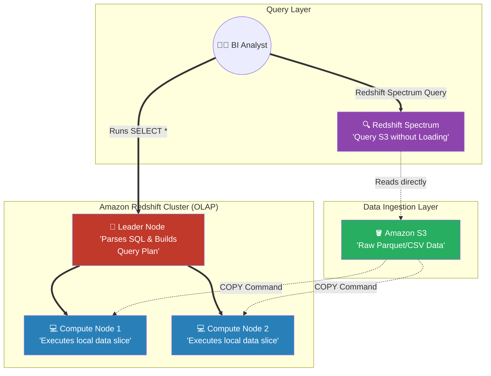

# 🚀 AWS Interview Cheat Sheet: AMAZON REDSHIFT (Q701–Q722)

*This master reference sheet begins Phase 14: Data Warehousing, focusing on Amazon Redshift—the petabyte-scale, columnar OLAP database engineered specifically for Business Intelligence and massive data analytics.*

---

## 📊 The Master Redshift Analytical Architecture

---

## 7️⃣0️⃣1️⃣ & Q715: What is Amazon Redshift and how is it different from a traditional database?
- **Short Answer:** Standard databases (like MySQL/RDS) are **OLTP** (Online Transaction Processing), designed to retrieve single rows instantly (e.g., retrieving a single customer's shopping cart). Redshift is **OLAP** (Online Analytical Processing) utilizing **Columnar Storage**. It is structurally designed to read massive columns of data simultaneously (e.g., summing up the total sales of every customer over 5 years in 3 seconds).

## 7️⃣1️⃣0️⃣ & Q711: What are Distribution Keys (DISTKEY) and Sort Keys (SORTKEY)?
- **Short Answer:** 
  - **Distribution Key (How data is spread):** Mathematically dictates which physical Compute Node a specific row of data is physically stored on. (Styles: `EVEN` distributes randomly, `ALL` copies the whole table to every node, `KEY` distributes based on a column like `user_id`).
  - **Sort Key (How data is ordered):** Mathematically dictates how the data is physically sorted on the hard drive itself. This geometrically replaces traditional SQL "Indexes" to drastically speed up `WHERE date > '2026'` queries.

## 7️⃣0️⃣3️⃣ & Q704 & Q712: What is Data Skew and how do you optimize performance?
- **Short Answer:** If you choose a terrible Distribution Key (e.g., distributing by `country` when 99% of your users are in the US), one Compute Node will fill to 99% disk capacity while the other 3 nodes sit at 1% capacity. This is **Data Skew**. 
- **Troubleshooting:** You identify skew by querying the `SVV_TABLE_INFO` system table. You fix it by executing an `ALTER TABLE` to violently mathematically shuffle the data using a heavily randomized `DISTKEY`.

## 7️⃣0️⃣5️⃣ Q705: What are common data loading issues in Redshift?
- **Short Answer:** Running hundreds of standard `INSERT` SQL statements in Redshift is an architectural disaster that will crash the cluster.
- **Interview Edge:** *"A Senior Architect absolutely never uses standard `INSERT` statements to load data into Redshift. You must aggressively enforce the **Amazon Redshift COPY command**. The COPY command uses mathematical parallel processing to pull millions of rows of CSV/Parquet data directly from Amazon S3 into the Compute Nodes simultaneously, maximizing ingestion speed."*

## 7️⃣1️⃣3️⃣ Q713: What is Redshift Spectrum?
- **Short Answer:** *The absolute definitive Redshift interview question.* 
- **Production Scenario:** If you have 50 Petabytes of historical cold data in Amazon S3, loading all 50 PB into Redshift would cost millions of dollars in SSD disks. **Redshift Spectrum** natively solves this. It allows the BI Analyst to run a standard SQL query in Redshift that magically mathematically physically reaches out and queries the S3 bucket directly *without ever importing or moving the 50PB of data into the Redshift cluster*.

## 7️⃣1️⃣9️⃣ Q719: What is the difference between a managed and unmanaged Amazon Redshift cluster?
- **Short Answer:** *CRITICAL ARCHITECTURAL CORRECTION:* **There is no such thing as an unmanaged Redshift cluster.**
- **Interview Edge:** *"The drafted answer claims you can have an 'unmanaged Redshift cluster'. This is factually completely false. Amazon Redshift is strictly a fully-managed AWS Database-as-a-Service architecture. If you want an 'unmanaged' analytical cluster, you are forced to mathematically provision raw EC2 instances and manually install a database engine like PostgreSQL. Redshift cannot be unmanaged."*

## 7️⃣2️⃣1️⃣ Q721: What is the maximum size of a single table in Amazon Redshift?
- **Short Answer:** *CRITICAL ARCHITECTURAL CORRECTION:* **A cluster can hold Petabytes, and a table spans the entire cluster.**
- **Interview Edge:** *"The drafted answer fatally claims the maximum size of a table is 60 TB because a table fits on a single node. This violently misunderstands Redshift's distributed architecture. A single Redshift table mathematically shards data across ALL nodes in the cluster simultaneously. Modern RA3 nodes support 128TB per node, meaning a 10-node cluster can trivially easily hold a single 1 Petabyte table!"*

## 7️⃣0️⃣9️⃣ Q709: What is the difference between a node and a cluster in Amazon Redshift?
- **Short Answer:** The **Cluster** is the overall engine. It strictly consists of exactly one **Leader Node** (the endpoint the user connects to that coordinates the query plan) and 1-to-128 **Compute Nodes** (the physical EC2 machines that hold the shards of disk data and execute the localized math).

## 7️⃣1️⃣7️⃣ Q717: What is a materialized view in Amazon Redshift?
- **Short Answer:** If a BI Dashboard runs a mathematically brutal SQL query summing up 1 billion rows every 5 minutes, it will crush the cluster CPU. A **Materialized View** pre-computes the 1-billion row sum precisely once, physically saves the "answer" to disk as a separate table, and delivers instantaneous sub-millisecond query results to the dashboard.

## 7️⃣0️⃣8️⃣ Q708: What are common security issues in Redshift?
- **Short Answer:** Native data governance.
- **Advanced Solution:** An Architect implements **Enhanced VPC Routing**. By default, when Redshift uses the `COPY` command to pull from S3, that traffic might transit the public AWS backbone. Enhanced VPC Routing mathematically forcefully locks the Redshift cluster so it can strictly only query S3 by routing traffic exclusively through your internal Private VPC Endpoints, ensuring PCI-DSS/HIPAA compliance.
