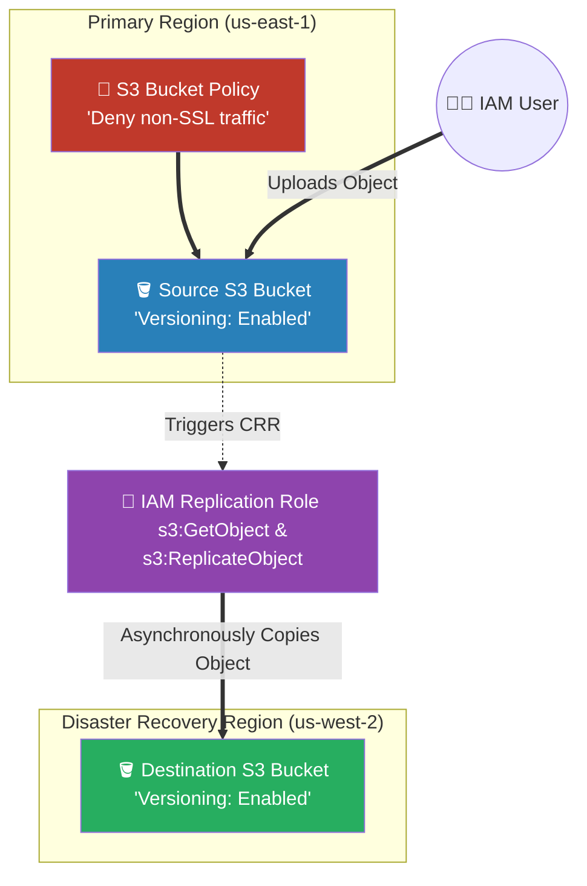

# 🚀 AWS Interview Cheat Sheet: AMAZON S3 (Q676–Q689)

*This master reference sheet marks Phase 12: Object Storage. It fundamentally breaks down Amazon Simple Storage Service (S3), aggressively correcting major industry myths regarding bucket size limits and upload mechanisms.*

---

## 📊 The Master S3 Security & Replication Architecture

---

## 6️⃣7️⃣6️⃣ & Q686: What is Amazon S3 and how is it different from traditional file storage (EBS)?
- **Short Answer:** Amazon S3 is an **Object Storage** service. Unlike EBS (Elastic Block Store), which works like a physical C: Drive formatting raw data blocks for an operating system, S3 stores files globally in a flat mathematical namespace across an unlimited array of servers. 
- **Interview Edge:** *"An Architect explicitly differentiates them by access pattern. S3 is designed for WORM (Write Once, Read Many) operations like photos or backups. You absolutely cannot install a MySQL database or an Operating System on an S3 Bucket because S3 physically does not support rapid sub-millisecond block-level editing."*

## 6️⃣7️⃣7️⃣ & Q688: What are the S3 Storage Classes and when do you use them?
- **Short Answer:** 
  1) **S3 Standard:** 99.99% Availability. For active, hot data.
  2) **S3 Standard-IA (Infrequent Access):** Much cheaper storage, but charges a mathematical **Retrieval Fee** per GB. Used for data accessed less than once a month. Minimum 30-day billing.
  3) **S3 One Zone-IA:** Data is NOT replicated across 3 Availability Zones. It lives in exactly one AZ. If that AZ physically burns down, the data is permanently destroyed. Used for easily reproducible thumbnails.
  4) **S3 Glacier Flexible Retrieval:** Deep archive. Data takes 1-5 hours to physically retrieve.
  5) **S3 Glacier Deep Archive:** The cheapest storage in AWS. Data takes 12-48 hours to retrieve.
  6) **S3 Intelligent-Tiering:** Automatically physically moves objects between Hot and Cold tiers based on Machine Learning access patterns for a small monthly monitoring fee.

## 6️⃣8️⃣1️⃣ Q681: What is the maximum file size that can be stored in Amazon S3?
- **Short Answer:** 5 Terabytes per object.
- **Interview Edge:** *"While the maximum object size is 5TB, you must know the API limits. A standard single `PUT Object` API call structurally maxes out at exactly **5 GB**. If you attempt to upload a 6GB video in one chunk, the API violently rejects it. An Architect seamlessly solves this by implementing the **S3 Multi-Part Upload API**, chopping the file into 10MB chunks and uploading them aggressively in parallel to maximize bandwidth."*

## 6️⃣8️⃣7️⃣ Q687: What are some common S3 issues and how do you troubleshoot them?
- **Short Answer:** Missing IAM permissions or aggressive VPC Endpoint Deny rules causing `403 Access Denied`.
- **Architectural Correction (MUST READ):** 
  - *"The drafted answer claims 'Bucket size limit exceeded' is a common issue. **This is completely, violently false.** Amazon S3 mathematically possesses perfectly **Infinite** storage capacity. There is absolutely zero maximum bucket size limit. You can store 500 Petabytes in a single bucket. If you state in an interview that an S3 bucket 'gets full', you will instantly fail the AWS architecture round."*

## 6️⃣8️⃣9️⃣ Q689: What is S3 Lifecycle and how can it help optimize storage costs?
- **Short Answer:** Without a Lifecycle Rule, a company paying for S3 Standard storage will eventually bankrupt themselves as data scales into the petabytes. An Architect writes an automated XML Lifecycle Rule:
  1) Day 0: Object lands in S3 Standard.
  2) Day 30: Automatically transition object mathematically to S3-IA.
  3) Day 90: Transition mathematically to Glacier Deep Archive.
  4) Day 365: Execute an **Expiration Rule** to permanently delete the object, ensuring $0 waste.

## 6️⃣7️⃣8️⃣ Q678: How do you troubleshoot S3 bucket permission issues?
- **Short Answer:** Understand the AWS explicit Deny chain. The IAM User Policy, the S3 Bucket Policy, the KMS Key Policy, and the VPC Endpoint Policy must all mathematically align. If even a single one contains an explicit `Deny`, the access is brutally blocked. 

## 6️⃣7️⃣9️⃣ Q679: What is S3 Transfer Acceleration?
- **Short Answer:** If a user in Australia tries to upload a 100GB file directly to an S3 bucket in Virginia over the public internet, TCP latency will aggressively throttle the upload to a crawl. S3 Transfer Acceleration exposes a special endpoint utilizing the **CloudFront Global Edge Network**. The Australian user uploads to the Sydney Edge Node, and the data aggressively rides AWS's private, dedicated fiber-optic backbone straight to Virginia at maximum speed.

## 6️⃣8️⃣4️⃣ Q684: What is S3 Select?
- **Short Answer:** If you have a 50GB CSV file in S3 and you only need row #55, a junior developer downloads the entire 50GB file to an EC2 instance to parse it, paying massive data transfer fees. An Architect uses **S3 Select** to push standard native `SELECT * FROM s3_object WHERE name = 'John'` SQL syntax directly into the S3 storage hardware layer. S3 parses the file physically on its own hardware and returns only the 1KB of data requested.

## 6️⃣8️⃣5️⃣ Q685: What is S3 Inventory?
- **Short Answer:** Running the `ListObjectsV2` API on a bucket with 500 million objects will mathematically take hours to paginate and cost hundreds of dollars in API fees. S3 Inventory organically circumvents this by asynchronously dumping a daily/weekly highly compressed CSV/Parquet report into a destination bucket containing a perfect mathematical index of every object, its size, and encryption status.

## 6️⃣8️⃣2️⃣ Q682: How does versioning work in Amazon S3, and what are its benefits?
- **Short Answer:** When a file is overwritten (e.g., uploading a new `config.json`), S3 mathematically retains the old file and attaches a unique Version ID. If a hacker uploads ransomware, you just delete the newest version to instantly expose the clean original version.
- **Production Scenario:** Once versioning is toggled ON, it legally cannot be completely turned OFF—it can only be "Suspended". To physically protect against a rogue Admin emptying the bucket, an Architect locks it using **MFA Delete**, mathematically forcing a physical 6-digit hardware token code to permanently delete an object version.

## 6️⃣8️⃣3️⃣ Q683: How do you troubleshoot S3 Cross-Region Replication (CRR) issues?
- **Short Answer:** CRR copies objects from `us-east-1` to `us-west-2` automatically for DR compliance. If it fails:
  1) Verify **Versioning** is legally enabled on BOTH the Source AND Destination buckets. (CRR physically cannot operate without Versioning).
  2) Ensure the IAM Role assigned explicitly possesses the `s3:ReplicateObject` permission targeting the destination bucket ARN.
