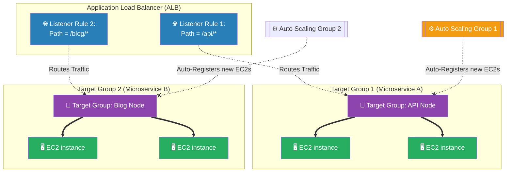

# 🚀 AWS Interview Cheat Sheet: TARGET GROUPS (Q511–Q518)

*This master reference sheet covers Target Groups—the logical backend routing destinations that mathematically decouple the Load Balancer frontline from the Auto Scaling Group compute instances.*

---

## 📊 The Master Target Group Routing Architecture

---

## 5️⃣1️⃣1️⃣ Q511: Can you explain some practical real-time scenarios related to AWS Target Groups?
- **Short Answer:** 
  1) **Microservices Path-Based Routing:** An ALB receives all traffic for `example.com`. The ALB routes any URL matching `/api` to the "Backend-API" Target Group, and any URL matching `/images` to the "Static-Image" Target Group.
  2) **Blue/Green Deployments:** You attach two separate Target Groups (V1 and V2) to a single ALB. You surgically alter the ALB mathematically to send 90% of traffic to V1, and exactly 10% of traffic to V2 (Canary release orchestration).

## 5️⃣1️⃣2️⃣ & Q513: Troubleshooting Target Groups (Health Checks & Routing Issues)
- **Short Answer:** If instances are constantly marking as "Unhealthy":
  1) **The 200 OK Requirement:** The Target Group Health Check physically sends an HTTP GET request to `/health` every 30 seconds. If the application returns a `301 Redirect` or a `404 Not Found` instead of explicitly returning a `200 OK`, the Target Group violently marks the instance as dead and permanently stops sending traffic to it.
  2) **Security Group Blockage:** The EC2 instances must have a rule explicitly allowing inbound Port 80/443 traffic specifically from the **Load Balancer's Security Group**.

## 5️⃣1️⃣4️⃣ Q514: What are the different types of load balancing that can be achieved using AWS Target Groups?
- **Short Answer:** Target Groups are the unified backend architecture specifically utilized by the **Application Load Balancer (ALB)**, **Network Load Balancer (NLB)**, and **Gateway Load Balancer (GWLB)**. 
- **Interview Edge:** *"If asked, strongly clarify that the legacy **Classic Load Balancer (CLB)** does NOT use Target Groups whatsoever. Target Groups were specifically invented for the V2 Load Balancers to permanently decouple the frontend Listeners from the backend compute pools."*

## 5️⃣1️⃣5️⃣ Q515: How can you ensure high availability and fault tolerance with AWS Target Groups?
- **Short Answer:** Target Groups natively perform aggressive, continuous **Health Checks**. If a server's Java runtime crashes, the server stops responding with a `HTTP 200`. The Target Group mathematically detects the failure within seconds and instantly mathematically ceases routing user traffic to that specific failing IP address, preventing customer outage.

## 5️⃣1️⃣6️⃣ Q516: Can you explain how you can configure sticky sessions using AWS Target Groups?
- **Short Answer:** Session Stickiness (Session Affinity) is mechanically configured strictly inside the Target Group attributes.
- **Production Scenario:** When enabled, the ALB mathematically injects a tracking cookie (e.g., `AWSALB`) into the client's browser. When the user clicks the next webpage, the ALB reads the cookie, ignores the standard Round-Robin load balancing algorithm, and actively forces the network packet back to the exact same physical EC2 machine that processed the previous request.

## 5️⃣1️⃣7️⃣ Q517: How can you monitor the performance of AWS Target Groups?
- **Short Answer:** Utilizing Amazon CloudWatch. The most critical operational metric for a Target Group is the `UnhealthyHostCount`. If an Architect sees this metric suddenly spike from 0 to 5, it means 5 servers simultaneously failed their health checks and the Target Group is actively purging them from the routing pool. (Other key metrics: `TargetResponseTime` and `HTTPCode_Target_5XX_Count`).

## 5️⃣1️⃣8️⃣ Q518: Can you explain how you can use AWS Target Groups with Auto Scaling to ensure scalability of your application?
- **Short Answer:** You physically attach the Target Group ARN natively to the **Auto Scaling Group (ASG)** configuration. 
- **Interview Edge:** *"This is the holy grail of AWS elasticity. When the ASG organically spots a CPU spike and automatically boots 3 brand new EC2 instances, the ASG mathematically injects those 3 new IP addresses directly into the Target Group registry completely automatically. The Target Group waits for the 3 instances to pass their Health Checks, and then dynamically begins routing live internet traffic to them with absolutely zero human intervention."*
