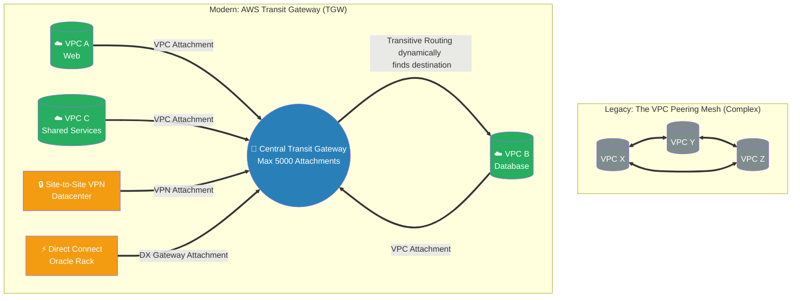

# 🚀 AWS Interview Cheat Sheet: TRANSIT GATEWAYS (Q290–Q301)

*This master reference sheet covers AWS Transit Gateway (TGW), the supreme enterprise solution that abolishes the mathematical chaos of VPC Peering by introducing native "Hub-and-Spoke" transitive routing.*

---

## 📊 The Master Transit Gateway (Hub-and-Spoke) Architecture

---

## 2️⃣9️⃣0️⃣ Q290: What is a Transit Gateway in AWS?
- **Short Answer:** AWS Transit Gateway (TGW) is a massively scalable, highly available regional network transit routing hub. It physically replaces the need for complex point-to-point VPC Peering connections by allowing you to connect thousands of VPCs and physical on-premises networks utilizing a clean, centralized **Hub-and-Spoke** topology.
- **Production Scenario:** A massive enterprise has 500 individual AWS Accounts, each with their own VPC. Instead of trying to build 124,750 individual VPC peering connections, they deploy a single AWS Transit Gateway at the center. Every VPC establishes exactly 1 attachment to the TGW, giving them instant mathematical access to all 499 other VPCs.

## 2️⃣9️⃣1️⃣ Q291: What are the benefits of using Transit Gateways in AWS?
- **Short Answer:** 
  1) **Simplification:** Abolishes peering meshes. 
  2) **Centralized Security:** Allows forcing all east-west (VPC-to-VPC) traffic through a central "Inspection VPC" (Network Firewall).
  3) **Scale:** Supports up to 5,000 attachments per region.
  4) **Multicast:** TGW is uniquely the only AWS networking construct that natively supports Multicast routing protocols globally.
- **Interview Edge:** *"As a Senior Architect, I always explain the Peering Formula: `N(N-1)/2`. If you have 100 VPCs, a full peering mesh requires 4,950 separate connections to manage. A Transit Gateway collapses that operational nightmare down to exactly 100 simple attachments."*

## 2️⃣9️⃣2️⃣ Q292: What are the requirements for setting up a Transit Gateway in AWS?
- **Short Answer:** You simply need AWS VPCs with absolutely **non-overlapping CIDR blocks** (e.g., `10.1.0.0/16` and `10.2.0.0/16`). If the IPs organically overlap, the Transit Gateway physically cannot know which spoke to route the traffic to.
- ***CRITICAL ARCHITECTURAL CORRECTION:* ** *Note: The originally drafted answer stated you "need" Network Firewall policies and VPN connections set up.* This is false. A Transit Gateway functions perfectly as a standalone internal AWS router connecting naked VPCs. You only attach VPNs or Firewalls if your specific corporate design requires hybrid connectivity.

## 2️⃣9️⃣3️⃣ Q293: What are the steps involved in setting up a Transit Gateway in AWS?
- **Short Answer:** 
  1. **Provision TGW:** Create the Transit Gateway object in the AWS Console.
  2. **Create Attachments:** Attach your physical building blocks (VPCs, VPNs, or Direct Connects) to the TGW boundary.
  3. **TGW Route Tables:** Configure the internal TGW Routing engine (deciding if VPC-A is legally allowed to talk to VPC-B).
  4. **VPC Route Tables:** Update your local Subnet Route Tables to point the opposing CIDR block manually to the `tgw-` ID (so the EC2 instance actually knows to send data out to the TGW).

## 2️⃣9️⃣4️⃣ Q294: What is the difference between a Transit Gateway and a VPC peering connection in AWS?
- **Short Answer:** **Transitive Routing.** This is the most legendary networking constraint in AWS. VPC Peering is strictly *Non-Transitive* (If A peers to B, and B peers to C, A still physically cannot talk to C). AWS Transit Gateway natively supports full *Transitive Routing* perfectly out of the box (A talks to TGW, TGW talks to C). 
- **Interview Edge:** *"VPC Peering is free, but physically doesn't scale. TGW inherently scales infinitely via transitive routing, but you fundamentally pay a per-attachment hourly fee, plus a heavy per-Gigabyte data processing tax for every packet that touches it."*

## 2️⃣9️⃣5️⃣ Q295: How do you troubleshoot Transit Gateway connection issues in AWS?
- **Short Answer:** **Route Table Asymmetry.** The number one reason TGWs fail is because the Administrator updated the central TGW Route Table, but completely forgot to update the local Subnet Route Tables inside the VPCs. You fundamentally must use AWS **VPC Reachability Analyzer** to trace the exact mathematical path hop-by-hop to discover which specific routing layer is actively dropping the return packet.

## 2️⃣9️⃣6️⃣ Q296: What is a Transit Gateway Attachment in AWS?
- **Short Answer:** An attachment is the physical "cable" plugging a spoke network into the central Transit Gateway hub. By establishing an attachment, you authorize the TGW to theoretically bridge that specific network to other connected entities based on routing rules.

## 2️⃣9️⃣7️⃣ Q297: What are the types of Transit Gateway Attachments in AWS?
- **Short Answer:** 
  1. **VPC Attachment:** Drops Elastic Network Interfaces (ENIs) directly into the target VPC subnets.
  2. **VPN Attachment:** Terminates an IPSec Site-to-Site tunnel.
  3. **Direct Connect (DX) Gateway Attachment:** Terminates massive private physical fiber optics.
  4. **Peering Attachment:** Peers one TGW in `us-east-1` dynamically to a second TGW in `eu-west-1` (Cross-Region).
  5. **Connect Attachment (SD-WAN):** Uses generic routing encapsulation (GRE) tunnels.

## 2️⃣9️⃣8️⃣ Q298: What is the difference between a VPC Attachment and a VPN Attachment in AWS Transit Gateway?
- **Short Answer:** A VPC Attachment leverages the internal, invisible AWS hypervisor infrastructure natively dropping high-speed software ENIs into the VPC subnets. A VPN Attachment generates a highly secure cryptographic IPSec termination endpoint actively designed to securely traverse the hostile public internet. Both act theoretically identical inside the TGW route table, but wildly differ in underlying transport cryptography.

## 2️⃣9️⃣9️⃣ Q299: What is the maximum number of Transit Gateway Attachments that can be associated with a Transit Gateway in AWS?
- **Short Answer:** The hard physical limit is **5,000** total attachments per Transit Gateway. If you possess more than 5,000 VPCs/VPNs, you must structurally deploy a second TGW and peer them together.

## 3️⃣0️⃣0️⃣ Q300: What is the purpose of Route Tables in Transit Gateway Attachments in AWS?
- **Short Answer:** TGW Route Tables act as the supreme master traffic cops. Every attachment must be "Associated" with a TGW Route Table. You can easily create complex micro-segmentation architectures. (e.g., The 'Production' Route Table actively prevents Production VPCs from routing to the 'Development' VPCs, even though they are plugged into the exact same physical TGW hardware).
- **Interview Edge:** *"This is known as 'VRF-lite' (Virtual Routing and Forwarding) in enterprise networking. By assigning completely different TGW Route Tables to different attachments, I can natively segregate overlapping networks and force specific traffic to an Inspection Firewall without building a second Transit Gateway."*

## 3️⃣0️⃣1️⃣ Q301: What are the steps involved in setting up Transit Gateway Attachments in AWS?
- **Short Answer:** 
  1. Navigate to the TGW Console and click **Transit Gateway Attachments**.
  2. Click **Create Transit Gateway Attachment**.
  3. Select the Target TGW ID.
  4. Select the Attachment Type (VPC, VPN, DX).
  5. *Critical for VPCs:* Select the target VPC ID, and physically select exactly one Subnet per Availability Zone where AWS will organically drop the physical network interfaces to connect the bridge.
  6. Map the attachment cleanly to a Transit Gateway Route Table.
