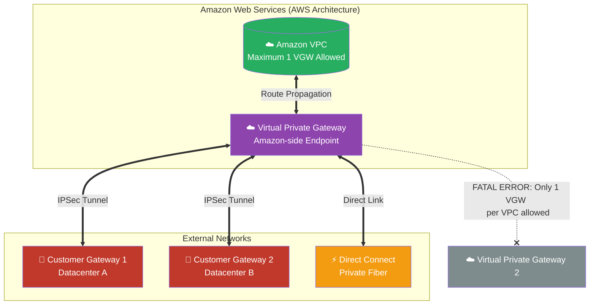

# 🚀 AWS Interview Cheat Sheet: VIRTUAL PRIVATE GATEWAYS (Q271–Q277)

*This master reference sheet covers the Virtual Private Gateway (VGW), the Amazon-side routing engine responsible for terminating highly encrypted IPSec tunnels directly onto your VPC.*

---

## 📊 The Master Virtual Private Gateway Architecture

---

## 2️⃣7️⃣1️⃣ Q271: What is a Virtual Private Gateway in AWS VPN?
- **Short Answer:** A Virtual Private Gateway (VGW) is the logical, highly-available AWS-side edge router that legally permits encrypted communication between your Amazon VPC and a remote network footprint. It sits definitively on the edge of the VPC boundary, terminating Site-to-Site VPN IPSec tunnels or AWS Direct Connect private connections.
- **Production Scenario:** A bank sets up a VGW on their Main VPC. They then establish 10 independent IPSec VPN tunnels from 10 different physical retail branch offices, universally terminating them all onto that single scalable AWS VGW endpoint.
- **Interview Edge:** *"A Virtual Private Gateway is not a single server. It is a highly redundant, massively scalable managed network appliance fundamentally distributed by AWS across multiple underlying infrastructure boundaries, effectively guaranteeing zero single points of physical failure."*

## 2️⃣7️⃣2️⃣ Q272: What are the requirements for setting up a Virtual Private Gateway in AWS VPN?
- **Short Answer:** The VPC must cleanly exist. You must create the Virtual Private Gateway (VGW) object logically and explicitly 'Attach' it to the VPC via the AWS API or Console.
- ***CRITICAL ARCHITECTURAL CORRECTION:* ** *Note: The originally drafted answer stated a VPC must have an IGW, a Public IP, and no NAT structure. This is a lethal AWS architectural myth.* A VPC **does not** require an Internet Gateway (IGW) or Public IPs to use a VGW. The entire supreme value of a VGW is to route private traffic completely devoid of the public internet. You can absolutely bind a VGW to a 100% strictly private, completely isolated VPC (often called a 'Dark VPC') to establish pure datacenter-to-cloud connectivity away from the world wide web.

## 2️⃣7️⃣3️⃣ Q273: What are the types of Virtual Private Gateways supported in AWS VPN?
- **Short Answer:** *ARCHITECTURAL CORRECTION:* While the concept remains, the precise terminology requires correction for Senior Engineering interviews. There are not two types of "Virtual Private Gateways". There is explicitly the **Virtual Private Gateway (VGW)** (The AWS-side endpoint router that AWS owns) and the **Customer Gateway (CGW)** (The physical firewall/router located on-premises that the Customer owns).
- **Interview Edge:** *"When explaining this in an interview, explicitly state: 'The bridge is formed by two pillars. The VGW is managed by AWS inside the cloud. The CGW is managed by the network engineer in the physical datacenter. Together, they form the boundaries of the VPN connection.'"*

## 2️⃣7️⃣4️⃣ Q274: How do you configure a Virtual Private Gateway in AWS VPN?
- **Short Answer:** First, you provision the Virtual Private Gateway object natively via the AWS Console or Terraform (`aws_vpn_gateway`). Second, you execute the **Attach to VPC** command binding it to exactly one target VPC. Finally, you configure either **Static Routing** (manually defining remote CIDR blocks) or **Dynamic Routing** utilizing Border Gateway Protocol (BGP) to autonomously learn routes.
- **Production Scenario:** An Architect deploys a VGW using BGP. When the physical corporate datacenter stands up a brand-new sub-network segment, the physical datacenter router advertises the new IP routes to the AWS VGW over BGP, meaning the VPC immediately and organically knows how to route traffic to the new building without any human administration.

## 2️⃣7️⃣5️⃣ Q275: Can you attach multiple Virtual Private Gateways to a single VPC in AWS VPN?
- **Short Answer:** *CRITICAL ARCHITECTURAL CORRECTION:* **NO.** **You can attach only ONE Virtual Private Gateway to a single VPC at any given time.** 
- **Interview Edge:** *"This is a mathematically enforced AWS hard limit. If an interviewer asks you to scale out by putting 5 VGWs on a VPC, they are testing you. You confidently state: 'A VPC possesses a strict 1-to-1 relationship with a Virtual Private Gateway. If I absolutely must terminate more VPN connections than a single VGW can mathematically support, I aggressively redesign the architecture to utilize an AWS Transit Gateway instead.'"*

## 2️⃣7️⃣6️⃣ Q276: What is the importance of configuring the correct routing configuration in a Virtual Private Gateway in AWS VPN?
- **Short Answer:** Routing determines precisely how traffic physically flows from the VPC subnets out into the VPN tunnel. 
- **Production Scenario:** Even if the IPSec tunnel is perfectly "UP" and encrypted (Green Status), if you forget to enable **Route Propagation** on the specific VPC internal Subnet Route Table, EC2 instances mathematically do not know the path exists. The VGW routing logic ensures the VPC dynamically inherits the correct target paths leading back to the corporate office.

## 2️⃣7️⃣7️⃣ Q277: How do you monitor and troubleshoot the Virtual Private Gateway in AWS VPN?
- **Short Answer:** 
  1) **CloudWatch Metrics:** Monitor `TunnelState` (0 for Down, 1 for Up) alongside `TunnelDataIn` and `TunnelDataOut` to verify physical encrypted throughput.
  2) **BGP State:** Verify explicitly that the Border Gateway Protocol status reads 'Up' to ensure autonomous route sharing.
  3) **VPC Flow Logs:** Analyze the elastic network interfaces of your EC2 instances to mathematically prove the application traffic is successfully attempting to route toward the VGW endpoint.
- **Interview Edge:** *"When troubleshooting a 'dead' VPN, I rely on the `TunnelState` metric mathematically. If both tunnels read `0`, the cryptographic IKE handshake is failing. If they read `1` but data isn't flowing, I immediately check the Subnet Route Table propagation flag, because 99% of the time, it's an internal routing failure, not a cryptographic failure."*
