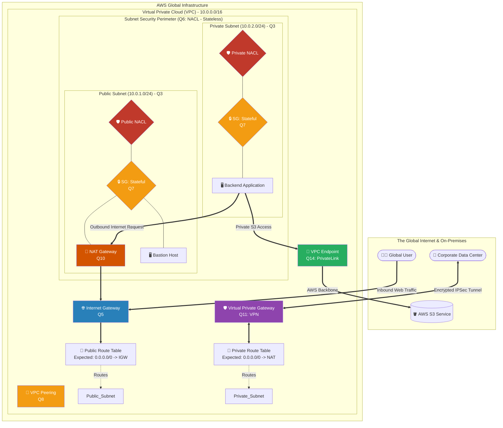

# 🚀 The Ultimate AWS VPC Interview Cheat Sheet (All 14 Questions)

*This master sheet provides Architect-level answers for all 14 VPC questions, utilizing a single, comprehensive Master Topology diagram that interconnects every concept.*

---

## 📊 The Master VPC Architecture Flow

---

## 1️⃣ Question 1: Can you explain what a VPC is in AWS?
- **Short Answer:** A Virtual Private Cloud (VPC) is a logically isolated, mathematically defined slice of the AWS public cloud completely dedicated to your AWS account. It forms the foundational networking baseline for all AWS resources, acting as a programmable digital data center.
- **Production Scenario:** Replacing physical hardware routers and switches in a physical data center with software-defined networking, allowing instantaneous provisioning of isolated network spaces.
- **Interview Edge:** *"A VPC is exactly equivalent to a traditional on-premises network, but digitized. It is the absolute highest level of network isolation in AWS."*

## 2️⃣ Question 2: How do you configure a VPC in AWS?
- **Short Answer:** You build it in sequential layers: 1) Allocate a primary IPv4 CIDR Block, 2) Slice the CIDR into regional Subnets across multiple Availability Zones, 3) Attach an Internet Gateway (IGW) to the VPC boundary, and 4) Meticulously author Route Tables to dictate traffic flow.
- **Production Scenario:** Deleting the insecure "Default VPC" immediately upon opening a new AWS account, and coding a custom VPC from scratch using Terraform to ensure absolute security compliance.
- **Interview Edge:** *"You never use the 'Default VPC' for production. You always define explicit IPv4 CIDR blocks and hardcode Route Tables to ensure implicit denies."*

## 3️⃣ Question 3: What is a subnet in AWS VPC?
- **Short Answer:** A Subnet is a smaller, carved-out chunk of the VPC's total IP address space. Crucially, a subnet is fundamentally bound to a single physical Availability Zone (AZ). 
- **Production Scenario:** Splitting a `10.0.0.0/16` VPC into multiple `10.0.1.0/24` subnets across us-east-1a and us-east-1b to ensure High Availability.
- **Interview Edge:** *"Subnets divide a VPC functionally and physically. I specifically use Private Subnets for databases and Public Subnets for Load Balancers to build defense-in-depth."*

## 4️⃣ Question 4: How does routing work in AWS VPC?
- **Short Answer:** Routing is dictated exclusively by **Route Tables**. Every subnet must be attached to a Route Table. The Route Table operates as a strict directional map, containing explicit target rules (e.g., `If destination is 0.0.0.0/0, send to IGW`).
- **Production Scenario:** Hardcoding the Private Subnet Route table to point `0.0.0.0/0` strictly to the internal NAT Gateway rather than the IGW, mathematically preventing inbound internet access to backend servers.
- **Interview Edge:** *"Route Tables are the connective tissue of the VPC. A subnet is only 'Public' if its Route Table explicitly possesses a 0.0.0.0/0 route pointing to an Internet Gateway."*

## 5️⃣ Question 5: What is an Internet Gateway in AWS VPC?
- **Short Answer:** An IGW is a horizontally scaled, highly-available AWS component attached to the edge of a VPC that physically connects the VPC to the public internet, allowing two-way communication.
- **Production Scenario:** Exposing an Application Load Balancer to the world so public customers can hit your e-commerce website.
- **Interview Edge:** *"An IGW serves two purposes: providing a physical target in your route tables for internet-bound traffic, and performing Network Address Translation (NAT) for EC2 instances that possess public IPv4 addresses."*

## 6️⃣ Question 6: What is a Network Access Control List (NACL) in AWS VPC?
- **Short Answer:** A NACL is an optional, **Stateless** security firewall that acts as a perimeter barrier explicitly wrapped around an entire Subnet, evaluating sequential numbered rules dynamically from lowest to highest.
- **Production Scenario:** Creating an explicit DENY rule in the NACL to actively drop massive inbound DDoS traffic originating from a known malicious IP address before the traffic can even enter the Subnet.
- **Interview Edge:** *"I use NACLs as a blunt-force perimeter measure. Because they support explicit DENY rules, they are the first line of defense against targeted IP attacks."*

## 7️⃣ Question 7: Can you explain the difference between a NACL and a Security Group in AWS VPC?
- **Short Answer:** NACLs operate at the Subnet level and are completely **Stateless** (meaning inbound/outbound rules must be explicitly managed separately). Security Groups operate at the Instance/EC2 level and are entirely **Stateful** (meaning if an inbound connection is allowed, the outbound response is automatically permitted regardless of outbound rules).
- **Production Scenario:** Using a Stateful Security Group to allow Port 80 traffic cleanly to a web server without manually coding outbound ephemeral ports, while leveraging the NACL to block a hacking syndicate.
- **Interview Edge:** *"Security Groups are localized, stateful, and only allow permits. NACLs are broad, stateless, and definitively support explicit Deny commands."*

## 8️⃣ Question 8: Can you explain what a VPC peering connection is in AWS?
- **Short Answer:** VPC Peering is a networking connection spanning two VPCs that allows seamless, encrypted routing of traffic utilizing private IPv4 addresses across the highly optimized AWS global backbone.
- **Production Scenario:** Connecting a company's Production VPC to a central Shared Services VPC (which holds Active Directory), completely avoiding the open internet.
- **Interview Edge:** *"VPC Peering strictly requires non-overlapping CIDR blocks. Furthermore, peering is definitively non-transitive; if VPC A peers with B, and B peers with C, A still cannot randomly talk to C."*

## 9️⃣ Question 9: What are some best practices for designing a VPC in AWS?
- **Short Answer:** Implement multiple Availability Zones; aggressively segment into Public, Private, and Database Subnets; severely restrict Security Groups utilizing the principle of least privilege; never use the Default VPC.
- **Production Scenario:** Structuring a strict 3-tier architecture where the UI sits in Public Subnets, API Logic hits Private Subnets, and RDS databases are absolutely isolated in pure Data Subnets.
- **Interview Edge:** *"Perfect VPC design relies on 'Defense-in-Depth'. I assume the perimeter will be breached, so I layer stringent Route Tables, stateless NACLs, and stateful SGs on top of one another."*

## 🔟 Question 10: Can you explain what a NAT gateway is in AWS VPC?
- **Short Answer:** A NAT Gateway is a fully managed AWS service that acts as a one-way mirror. It allows resources sitting entirely inside a Private Subnet (with no public IPs) to download updates from the internet, while fundamentally blocking the outside internet from initiating a connection back inwards.
- **Production Scenario:** Allowing a private RDS database or an isolated EC2 worker node to securely download Linux kernel patches from the internet without exposing the server to public internet vulnerabilities.
- **Interview Edge:** *"Deploying a NAT Gateway into a Public Subnet and pointing the Private Route Table toward it immediately solves out-of-bounds internet dependencies without compromising internal private isolation."*

## 1️⃣1️⃣ Question 11: What is a VPN connection in AWS VPC?
- **Short Answer:** A Site-to-Site VPN creates a heavily encrypted IPSec tunnel physically bridging an on-premises physical corporate data center directly to the AWS Virtual Private Cloud over the public internet.
- **Production Scenario:** Allowing corporate employees working in a physical office building to securely ping and manage Private EC2 servers hosted in AWS without exposing the EC2 servers to the general web.
- **Interview Edge:** *"To architect a Site-to-Site VPN, you bind a Virtual Private Gateway (VGW) to the AWS VPC, configure a Customer Gateway (CGW) at the on-premise firewall, and establish the encrypted encrypted IPSec tunnel between them."*

## 1️⃣2️⃣ Question 12: How do you troubleshoot connectivity issues in an AWS VPC?
- **Short Answer:** Logically trace the pipeline. Verify IGW/NAT attachments, check Route Table targeting, evaluate Security Group inbound limits, verify NACL ephemeral port configurations, and check physical EC2 health.
- **Production Scenario:** An application server suddenly can't reach the internet. The Architect checks the Route Table and realizes a Junior Dev accidentally deleted the `0.0.0.0/0` route pointing to the NAT Gateway.
- **Interview Edge:** *"If I hit a networking wall, I instantly enable VPC Flow Logs. Flow Logs aggressively record the source, destination, and ACCEPT/REJECT status of every single packet, fundamentally proving if the drop is occurring at the NACL or the Security Group."*

## 1️⃣3️⃣ Question 13: How do you secure your VPC in AWS?
- **Short Answer:** Employ overlapping security perimeters. Bind IAM policies natively to endpoints, utilize Security Groups for instance-level isolation, deploy NACLs for Subnet firewalls, and aggressively encrypt data-in-transit utilizing TLS protocols.
- **Production Scenario:** Enforcing a rigorous security matrix where the Database EC2 server's Security Group only explicitly accepts inbound Port 3306 traffic if the traffic organically originates from the Application EC2's specific Security Group ID.
- **Interview Edge:** *"Security Groups should never reference open IP blocks; they should reference other Security Groups. This dynamically ensures that even if IP addresses change rapidly during an Auto-Scaling event, the security topology remains mathematically impenetrable."*

## 1️⃣4️⃣ Question 14: Can you explain what VPC endpoints are in AWS?
- **Short Answer:** VPC Endpoints surgically connect your isolated VPC directly to external AWS managed services (like Amazon S3 or DynamoDB) using the internal AWS physical backbone, completely bypassing the public internet and avoiding massive NAT Gateway costs.
- **Production Scenario:** An EC2 instance sitting in a Private Subnet needs to stream 50 Terabytes of logs to S3. Instead of routing that traffic through the expensive NAT Gateway to the public internet, the Architect deploys an S3 Gateway Endpoint.
- **Interview Edge:** *"VPC Endpoints mathematically eliminate egress costs and data exposure. Connecting a private VPC to Amazon S3 via a Gateway Endpoint ensures the data never traverses the open web, strictly satisfying stringent financial and banking compliance mandates."*
