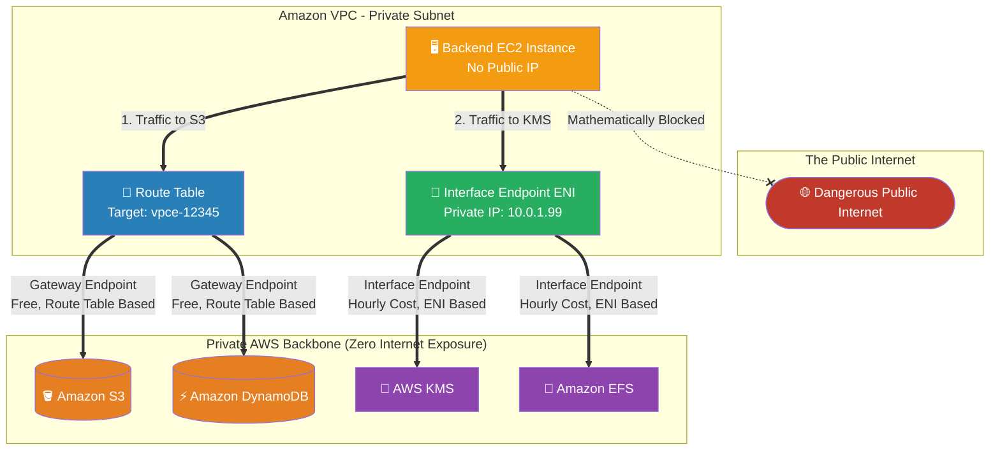

# 🚀 AWS Interview Cheat Sheet: VPC ENDPOINTS & PRIVATELINK (Q95–Q104)

*This master reference sheet clarifies exactly how to keep highly sensitive VPC traffic off the public internet by using Gateway Endpoints (Route Tables) and Interface Endpoints (ENIs).*

---

## 📊 The Master VPC Endpoint Architecture (Gateway vs. Interface)

---

## 9️⃣5️⃣ Q95: What is an Endpoint in AWS?
- **Short Answer:** A VPC Endpoint is an internal, private backdoor connecting your heavily isolated VPC directly to managed AWS services (like S3, DynamoDB, or KMS). It natively uses the massive, physical AWS backbone network to route data, utterly bypassing the public internet, NAT Gateways, and VPN connections.
- **Production Scenario:** A healthcare company possesses 50 Terabytes of HIPAA-compliant patient records on private EC2 instances. They must back this data up to S3. They deploy an S3 Endpoint so the patient data flows privately entirely within AWS circuitry.
- **Interview Edge:** *"Without an endpoint, an EC2 instance in a private subnet must route out through an expensive NAT Gateway to hit an S3 bucket's public REST API. Endpoints structurally eliminate the NAT architecture and the exposure risk."*

## 9️⃣6️⃣ Q96: What are the benefits of using Endpoints in AWS?
- **Short Answer:** 1) **Security:** Absolute isolation from the public web. 2) **Compliance:** Satisfies extreme FinOps/HIPAA mandates. 3) **Cost:** Eliminates massive data-processing charges generated by pushing Terabytes of data through NAT Gateways. 4) **Simplicity:** No IGWs required.
- **Production Scenario:** A data engineering team writes 100TB to S3 every month. Going through a NAT Gateway costs ~$0.045 per GB (nearly $4,500/month in egress fees). A Gateway Endpoint costs $0.00 to process data to S3.
- **Interview Edge:** *"In an enterprise interview, I always frame Endpoints as a FinOps (Financial Operations) tool just as much as a security tool. Endpoints violently destroy bandwidth charges for internal AWS communication."*

## 9️⃣7️⃣ Q97: What are the types of Endpoints in AWS?
- **Short Answer:** There are two distinct types: **Gateway Endpoints** (which manipulate Route Tables to route traffic) and **Interface Endpoints** (powered by AWS PrivateLink, which injects a physical Elastic Network Interface/ENI directly into your subnet and assigns it a private IP).
- **Production Scenario:** Deploying a Gateway Endpoint to route massive S3 backups for free, whilst deploying an Interface Endpoint to privately hit the AWS KMS API to retrieve encryption keys organically using a local private IP address.
- **Interview Edge:** *"The critical distinction is mechanism: Gateway Endpoints alter your routing logic without consuming an IP address. Interface Endpoints consume a local IP address and utilize DNS to reroute the AWS API calls locally."*

## 9️⃣8️⃣ Q98: What are some common use cases for Gateway Endpoints in AWS?
- **Short Answer:** Gateway Endpoints support exactly TWO AWS services: **Amazon S3** and **Amazon DynamoDB**. They are exclusively utilized for high-throughput, bulk data transfers to these specific object/NoSQL storage tiers without incurring massive NAT data-processing fees.
- **Production Scenario:** Running massive nightly ETL (Extract, Transform, Load) Apache Spark jobs on EMR inside a private subnet, reading/writing Petabytes of temporary data back and forth to S3 natively over the AWS backbone.
- **Interview Edge:** *"If an interviewer asks what services use Gateway Endpoints, you unequivocally answer: 'S3 and DynamoDB. Everything else in AWS uses Interface Endpoints.'"*

## 9️⃣9️⃣ Q99: What are some common use cases for Interface Endpoints in AWS?
- **Short Answer:** Interface Endpoints (PrivateLink) are utilized to hit the REST APIs of virtually every other AWS service privately. This includes systems like AWS KMS (encryption), Amazon ECR (pulling private Docker images), CloudWatch (pushing internal logs), and Amazon SNS/SQS.
- **Production Scenario:** An ECS Fargate cluster sits in an entirely isolated Private Subnet with no NAT Gateway. It must pull a Docker image to start. The Architect deploys an Interface Endpoint for Amazon ECR so the cluster can seamlessly pull the image locally using the `10.0.1.X` private IP without hitting the internet.
- **Interview Edge:** *"Interface Endpoints are powered by AWS PrivateLink. Unlike Gateway Endpoints (which are free), Interface Endpoints charge a continuous hourly uptime fee plus a small per-GB data processing fee—so they must be used strategically."*

## 1️⃣0️⃣0️⃣ Q100: How do you create an Endpoint in AWS?
- **Short Answer:** Open the VPC Console -> Navigate to **Endpoints** -> Click **Create Endpoint** -> Search your target AWS service (e.g., `com.amazonaws.us-east-1.s3`) -> Select your VPC. For Gateway, select Route Tables. For Interface, select Subnets, assign a Security Group, and click **Create Endpoint**.
- **Production Scenario:** Writing a Terraform module that deploys an `aws_vpc_endpoint` block of type `Interface` bound to a specific Security Group that only permits Port 443 inbound from the local Application CIDR range.
- **Interview Edge:** *"Creating an Interface Endpoint physically drops an ENI into your subnet. Therefore, it requires an attached Security Group to govern access. Gateway Endpoints do not use Security Groups because they exist at the routing layer."*

## 1️⃣0️⃣1️⃣ Q101: How do you configure Endpoint policies in AWS?
- **Short Answer:** Endpoint Policies are standard JSON IAM documents defining explicitly who/what is allowed to pass entirely through the Endpoint connection. You navigate to the endpoint, select the **Policy** tab, and specify granular `Allow` or `Deny` rules for specific IAM Principals or AWS Resource ARNs.
- **Production Scenario:** An S3 Gateway Endpoint is created. By default, it allows full access (`*`) to any S3 bucket. The Architect locks the JSON policy down to explicitly state: *"Only allow traffic passing through this Endpoint to interact with `arn:aws:s3:::my-secure-corporate-bucket`."*
- **Interview Edge:** *"Endpoint Policies are the ultimate data-exfiltration defense. Even if an insider threat possesses Admin IAM credentials, if the Endpoint Policy mathematically denies outbound traffic to non-corporate S3 buckets, the attacker physically cannot steal the data."*

## 1️⃣0️⃣2️⃣ Q102: Can you update the configuration of an Endpoint in AWS?
- **Short Answer:** Yes. You can dynamically modify the attached Security Groups (for Interface Endpoints), the associated Route Tables (for Gateway Endpoints), and the JSON Endpoint Policy without deleting and recreating the endpoint.
- **Production Scenario:** The Security team audits the network and realizes the S3 Gateway Endpoint has a completely open `*` policy. The architect hot-swaps the JSON policy live in production to restrict access exclusively to three approved S3 buckets.
- **Interview Edge:** *"While you can update policies and security geometries, you cannot transform an Interface Endpoint into a Gateway Endpoint. The foundational architecture type is strictly immutable."*

## 1️⃣0️⃣3️⃣ Q103: How do you delete an Endpoint in AWS?
- **Short Answer:** Open the VPC Console -> select **Endpoints** -> check the target endpoint -> click **Actions** -> choose **Delete Endpoint** -> confirm deletion.
- **Production Scenario:** Decommissioning a legacy environment. The Architect deletes the S3 Gateway Endpoint. The AWS Console autonomously removes the underlying associated routing rules from the connected Route Tables organically.
- **Interview Edge:** *"Deleting an Interface Endpoint violently severs the PrivateLink connection and physically destroys the ENI in your subnet. Applications relying on that private IP/DNS for AWS API interactions will immediately hard-fail and require a NAT Gateway path."*

## 1️⃣0️⃣4️⃣ Q104: Can you access AWS services through an Endpoint from outside of your VPC?
- **Short Answer:** By default, No for Gateway Endpoints. However, **Yes for Interface Endpoints** *if* you utilize AWS Direct Connect or a Site-to-Site VPN.
- **Production Scenario:** An on-premises corporate server needs to privately upload data to an S3 bucket. The Architect cannot use the Gateway Endpoint (because Gateway Endpoints physically cannot be accessed from outside the VPC). Instead, the Architect deploys an S3 Interface Endpoint (PrivateLink), and routes the on-premise traffic over AWS Direct Connect to hit the Interface Endpoint's local Private IP.
- **Interview Edge:** *"This is a senior-architect exam trap. Gateway Endpoints do NOT extend over standard VPN or Direct Connect. If you need on-premise servers to natively hit AWS APIs without touching the open internet, you are structurally forced to deploy Interface Endpoints (PrivateLink) because they provide physical ENIs/Private IPs that on-premise routers can comfortably target."*
