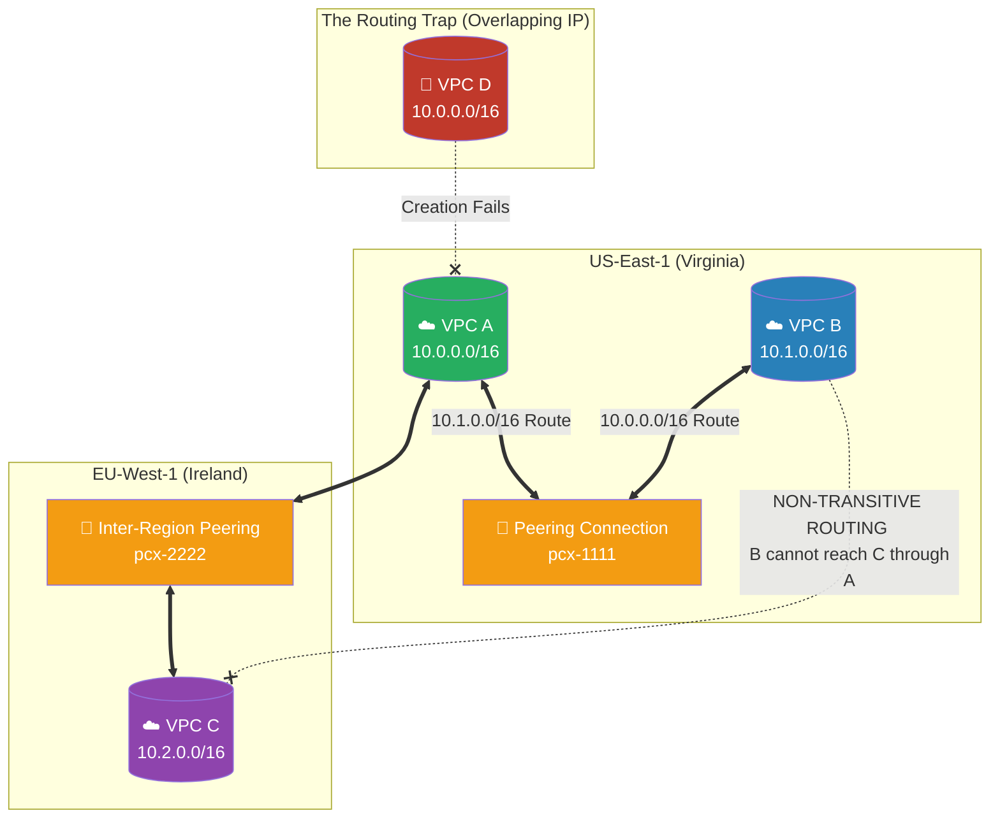

# 🚀 AWS Interview Cheat Sheet: VPC PEERING (Q135–Q150)

*This master reference sheet breaks down the critical mechanics of VPC Peering, explicitly focusing on cross-region capabilities, overlapping CIDR block restrictions, and the inflexible rule of non-transitive routing.*

---

## 📊 The Master VPC Peering Topology (Non-Transitive Architecture)

---

## 1️⃣3️⃣5️⃣ Q135: Can you explain what VPC peering is in AWS?
- **Short Answer:** VPC Peering is a direct networking connection between two specific VPCs that routes traffic strictly via internal IPv4 or IPv6 addresses. It physically utilizes the private AWS global backbone network, completely bypassing the public internet, thereby establishing a highly secure, high-bandwidth P2P (Peer-to-Peer) virtual topology.
- **Production Scenario:** A company acquires a startup. To securely access the startup's internal customer database without exposing it to the internet, the company peers their corporate VPC directly to the startup's existing VPC.
- **Interview Edge:** *"VPC Peering does not rely on a virtual gateway or a VPN connection. Behind the scenes, it utilizes the exact same highly redundant physical infrastructure that powers a VPC itself, meaning peering connections have no single point of failure and zero bandwidth bottlenecks."*

## 1️⃣3️⃣6️⃣ Q136: What are some benefits of using VPC peering?
- **Short Answer:** 1) Absolute security (traffic mathematically remains on the AWS dark fiber). 2) Financial efficiency (inter-AZ data transfer fees apply, but you entirely avoid NAT Gateway data-processing fees and Egress internet costs). 3) Lowest possible global latency between distinct AWS network environments.
- **Production Scenario:** A microservice in VPC A queries an ElasticSearch cluster in VPC B a million times per minute. Routing this over an IGW and NAT Gateway would financially crush the company. Peering the VPCs makes the API calls execute at native LAN speeds natively on private IPs.
- **Interview Edge:** *"The ultimate benefit is structural simplicity. Unlike AWS Direct Connect or Transit Gateways which require massive configuration, Peering is organically native to the VPC routing layer and essentially free to establish."*

## 1️⃣3️⃣7️⃣ Q137: Can you explain the process of setting up a VPC peering connection in AWS?
- **Short Answer:** It is a topological handshake. 1) The 'Requester' VPC sends a Peering Request to the 'Accepter' VPC. 2) The Accepter explicitly clicks "Accept Request." 3) Both VPC administrators deliberately update their respective Route Tables to point the other VPC's CIDR block directly to the new `pcx-` connection ID. 4) Both update Security Groups to allow the incoming IP ranges.
- **Production Scenario:** Running `terraform apply` to create the `aws_vpc_peering_connection`, and writing a secondary Terraform module that automatically provisions the resulting `aws_route` blocks targeting the new peering connection.
- **Interview Edge:** *"Without the final Route Table and Security Group modifications, the Peering Connection is actively 'Live', but utterly useless. The mechanical connection exists, but the software routing still drops the packets blindly."*

## ❓ Q: How many VPCs can be peered together in AWS?
- **Short Answer:** By default, AWS limits you to **50 active peering connections per VPC**. However, you can request a strict quota increase up to a maximum of **125 peering connections per VPC**.
- **Production Scenario:** If an enterprise has 500 isolated Spoke VPCs, they logically cannot peer them all together in a massive spider-web topological mesh because it grossly violates the 125 hard Peering Limit constraint.
- **Interview Edge:** *"Once an architecture crests 50 to 125 interconnected VPCs, VPC Peering structurally collapses under Route Table management weight. At this enterprise scale, a Senior Architect fundamentally mandates an AWS Transit Gateway instead."*

## 1️⃣3️⃣8️⃣ Q138: Can VPCs in different AWS accounts be peered together?
- **Short Answer:** Yes, easily. During the peering creation phase, the Requester simply provides the exact **Account ID** of the Accepter. The Accepter logs into their separate AWS account and explicitly accepts the remote request.
- **Production Scenario:** Creating a 'Shared Services' VPC (holding Active Directory and logging agents) in a root AWS account, and Cross-Account peering it securely into 20 distinctly isolated AWS Application accounts.
- **Interview Edge:** *"Cross-account peering is the absolute foundation of a multi-account 'Landing Zone' architecture. AWS explicitly prevents brute-force peering; the Accepter account must mathematically consent."*

## 1️⃣3️⃣9️⃣ Q139: Can you peer VPCs in different regions?
- **Short Answer:** Yes, utilizing **Inter-Region VPC Peering**. The traffic flows over the deep-ocean physical fiber backbone that AWS owns and operates, completely avoiding the public internet.
- **Production Scenario:** A company natively replicates massive SQL datastores continuously from their Primary production VPC in `eu-west-1` (Ireland) to their Disaster Recovery VPC in `ap-southeast-1` (Singapore) securely over an Inter-Region Peer.
- **Interview Edge:** *"Inter-Region peering natively encrypts traffic at the physical hypervisor layer. You do not need to build VPN IPSec tunnels between regions; AWS secures the dark fiber structurally."*

## 1️⃣4️⃣0️⃣ Q140: How do you troubleshoot connectivity issues with a VPC peering connection?
- **Short Answer:** 1) Did the Accepter accept the connection? (Status must be `Active`). 2) Do the Route Tables in BOTH VPCs specifically route the opposing CIDR block to the `pcx-` ID? 3) Do the Security Groups in the destination VPC explicitly whitelist the source VPC's CIDR block? 4) Do the NACLs explicitly allow the traffic?
- **Production Scenario:** A developer successfully pings Server B from Server A, but Server B cannot ping Server A. The Architect traces this asynchronous breakdown to Server B's Route Table missing the explicit return route to Server A.
- **Interview Edge:** *"Peering connectivity must always be treated symmetrically. Because routing in AWS is not dynamically learned through a standard peering connection, every outbound and return route must be explicitly hardcoded by the architect."*

## 1️⃣4️⃣1️⃣ Q141: Is it possible to modify a VPC peering connection after it has been created?
- **Short Answer:** You can modify DNS resolution settings (allowing the connection to translate public AWS DNS hostnames to private IPs), but you are mathematically prevented from modifying the core topological CIDR blocks or the associated VPCs.
- **Production Scenario:** A company wants to enable "DNS Resolution" across the peer so that when developers ping standard internal AWS hostnames, it organically resolves across the peering connection. Both VPCs must modify the connection to `EnableDnsSupport`.
- **Interview Edge:** *"A Peering Connection is fundamentally a static pipeline mapped to static VPC IDs. If you must change a VPC, you cannot 'edit' the peer; you systematically destroy the connection and initiate a brand-new handshake."*

## 1️⃣4️⃣2️⃣ Q142: Can you delete a VPC peering connection?
- **Short Answer:** Yes. Either the Requester or the Accepter can delete the connection instantly via the Console or API. Deleting the connection immediately severs all active network state.
- **Production Scenario:** An active security containment maneuver. If VPC A gets compromised by ransomware, the Security Administrator instantly deletes the Peering Connection, successfully preventing the malware from spreading laterally into VPC B.
- **Interview Edge:** *"When a peering connection is abruptly deleted, AWS intelligently flags any Route Table entries pointing to that specific connection as a 'Blackhole', indicating structurally that the physical pipeline no longer exists."*

## 1️⃣4️⃣3️⃣ Q143: Are there any limitations to using VPC peering in AWS?
- **Short Answer:** Yes. The three devastating absolute limitations: 1) You physically cannot peer VPCs with overlapping CIDR blocks. 2) **No Transitive Peering** (If VPC A peers to B, and B peers to C, A still physically cannot talk to C). 3) Hard limit of 125 peering connections per VPC.
- **Production Scenario:** Architecting a hub-and-spoke model using only peering. Because peering is non-transitive, if Spoke 1 needs to talk to Spoke 2, you are forced to build a dedicated peer directly between them, creating a mathematically unmanageable web of connections.
- **Interview Edge:** *"The 'No Transitive Peering' strictly forces architectures into either a full mesh (mathematically complex) or pivoting aggressively to AWS Transit Gateway, which natively supports transitive dynamic routing."*

## 1️⃣4️⃣4️⃣ Q144: How does VPC peering differ from a VPN connection?
- **Short Answer:** VPC Peering physically connects two AWS VPC infrastructures securely utilizing the private AWS dark fiber backbone. A VPN (Virtual Private Network) connects an AWS VPC to a legacy physical on-premises network utilizing heavily encrypted IPSec tunnels traveling visibly over the chaotic public internet.
- **Production Scenario:** If joining two departments entirely hosted in AWS, the Architect uses VPC Peering. If a hospital must connect a physical MRI machine server room to AWS, the Architect uses a Site-to-Site VPN or Direct Connect.
- **Interview Edge:** *"VPC Peering operates at native unthrottled LAN speeds with zero computational routing overhead. VPNs are vastly slower because the actual edge routers are forced to rigorously encrypt and decrypt every single external packet mathematically."*

## 1️⃣4️⃣5️⃣ Q145: What happens if the IP address ranges of the peered VPCs overlap?
- **Short Answer:** The AWS Console physically rejects the connection attempt violently. VPC Peering relies on absolute routing logic; if two VPCs share `10.0.0.0/16`, a router physically cannot know which VPC the IP `10.0.1.55` actually belongs to.
- **Production Scenario:** A corporation buys out a competitor. Both IT departments lazily used the default `10.0.0.0/16` AWS block. The Architect cannot peer them. The competitor's entire infrastructure must be dismantled and rebuilt on `10.1.0.0/16` to establish routing.
- **Interview Edge:** *"This limitation highlights the most supreme rule of Cloud Architecture: IP Address Management (IPAM) must be globally planned before deploying your very first VPC to mathematically guarantee zero future IP overlap."*

## 1️⃣4️⃣6️⃣ Q146: Can you peer VPCs with different CIDR blocks?
- **Short Answer:** Yes, this is the exact strict requirement. As long as the CIDR subnets are completely distinct and non-overlapping (e.g., `10.0.0.0/16` and `192.168.0.0/16`), the peering connection functions perfectly.
- **Production Scenario:** A centralized Logging VPC is built on `172.16.0.0/16`. It successfully peers with 10 different application VPCs occupying `10.1.0.0/16`, `10.2.0.0/16`, etc., safely aggregating logs globally because none of the prefixes organically overlap.
- **Interview Edge:** *"AWS strictly enforces the 'Longest Prefix Match' routing protocol. Therefore, the CIDR blocks cannot even be a subset of each other. If VPC A is `10.0.0.0/16` and VPC B is `10.0.1.0/24`, the peer will still violently fail."*

## 1️⃣4️⃣7️⃣ Q147: Can you modify the route tables of a peered VPC?
- **Short Answer:** Yes, manually modifying the Route Tables is an absolutely mandatory post-creation step. You must explicitly author an exact rule pointing the opposing peered VPC's target CIDR block directly to the `pcx-` connection ID.
- **Production Scenario:** Establishing a peering connection is like laying down a physical bridge. Updating the Route Table is instructing the toll-booth operators to actually send cars across the bridge instead of turning them around. 
- **Interview Edge:** *"Because routing is strictly localized, the Requester Account Administrator physically cannot modify the Accepter Account's Route Table. It demands coordinated structural execution between both account administrators."*

## 1️⃣4️⃣8️⃣ Q148: Can VPCs in different AWS regions communicate with each other using VPC peering?
- **Short Answer:** Yes. AWS formally refers to this as **Inter-Region VPC Peering**. It acts flawlessly exactly like standard peering, but the traffic seamlessly traverses the massive trans-continental physical fiber cables owned by AWS.
- **Production Scenario:** A web server in Tokyo (`ap-northeast-1`) needs to pull configuration data from a database in Frankfurt (`eu-central-1`). The Architect establishes an Inter-Region Peer, ensuring the data is processed globally without ever touching the insecure public web.
- **Interview Edge:** *"While it is technically identical, Inter-Region Peering possesses different FinOps impacts. Data transferred over a regional peer explicitly incurs cross-region data transfer billing rates, which are aggressively higher than local inter-AZ rates."*

## 1️⃣4️⃣9️⃣ Q149: How can you monitor the traffic between peered VPCs?
- **Short Answer:** By enabling **VPC Flow Logs** on the specific primary Elastic Network Interfaces (ENIs) of the instances involved, or globally capturing logs at the Subnet/VPC perimeter layer. 
- **Production Scenario:** An Architect receives an alert that traffic is dropping between peered microservices. They query the VPC Flow Logs centrally via Amazon Athena, filter for the `pcx-` connection IDs, and identify exactly which EC2 Security Group is executing the `REJECT` commands.
- **Interview Edge:** *"VPC Flow Logs are critical here because AWS does not provide 'connection-level' metrics natively for a peering pipeline. To audit a peering connection, you must rigorously analyze the Flow Logs of the source and destination ENIs."*

## 1️⃣5️⃣0️⃣ Q150: Can you peer VPCs with different AWS accounts?
- **Short Answer:** Yes, completely natively. It utilizes the identical `pcx-` architecture, strictly requiring the Requester to provide the Accepter's specific AWS Account ID for cross-account authorization.
- **Production Scenario:** A Managed Service Provider (MSP) hosts isolated continuous-integration (CI/CD) pipelines in their own AWS Account. They seamlessly peer their CI/CD VPC directly back into the remote Customer's AWS distinct Account footprint to securely deploy code.
- **Interview Edge:** *"Cross-account peering demands stringent lateral security. After establishing the 'bridge', I aggressively apply 'Zero Trust' Security Groups across the peer, ensuring my corporate VPC accepts traffic exclusively from the vendor's singular specific Elastic IP signature, effectively preventing vendor-compromise bleeding."*
