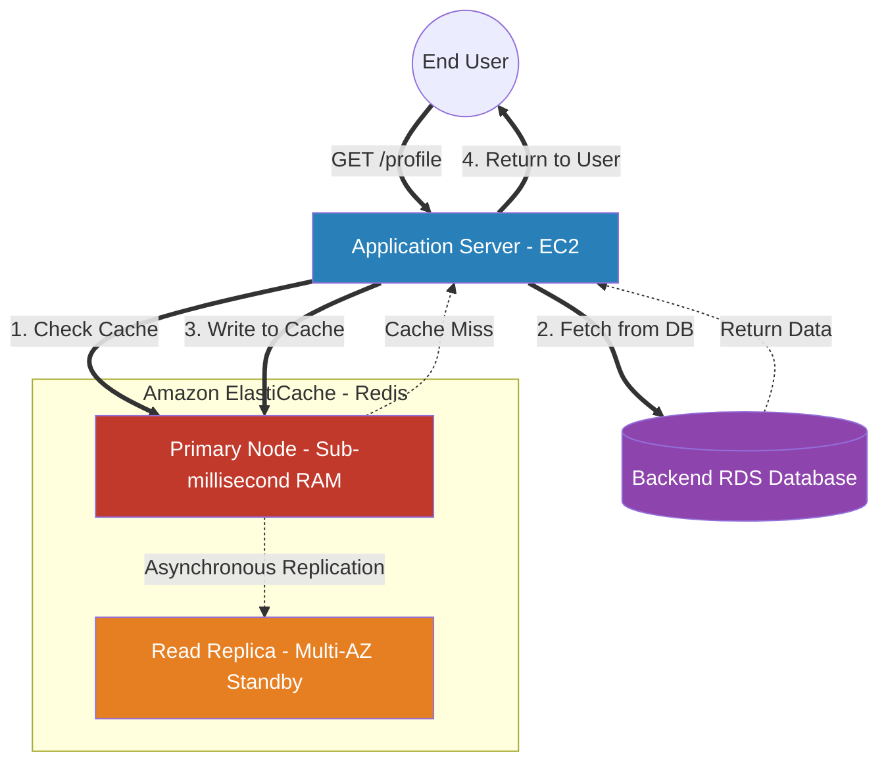

# 🚀 AWS Interview Cheat Sheet: AMAZON ELASTICACHE (Q801–Q820)

*This master reference sheet initiates Phase 18: In-Memory Caching. It strictly covers Amazon ElastiCache, resolving the duplicate numbering from the previous section (Q781-Q800) into Q801-Q820.*

---

## 📊 The Master ElastiCache Redis Architecture

---

## 8️⃣0️⃣1️⃣ & 8️⃣0️⃣2️⃣: What is AWS ElastiCache and what are its core advantages?
- **Short Answer:** AWS ElastiCache is a purely managed, globally scalable in-memory data store. Because data is stored physically in RAM instead of on magnetic/SSD disks, it delivers mathematically guaranteed **sub-millisecond latency**.
- **Interview Edge:** *"If an RDS database is processing 100,000 identical `SELECT` queries per second for a gaming leaderboard, the database CPU will melt. An Architect deploys ElastiCache in front of RDS. The application hits the cache in 0.5 milliseconds, completely absorbing the 100k requests and utterly neutralizing the load on the backend database."*

## 8️⃣0️⃣3️⃣ & 8️⃣1️⃣3️⃣: What is the exact architectural difference between Memcached and Redis?
- **Short Answer:** *This is the most critical caching interview question.*
- **Memcached:** Extremely basic, pure Key-Value store. It is **Multi-Threaded** (scales vertically beautifully on a single node) but absolutely volatile. It does NOT support Multi-AZ failover or backups. If the node reboots, the cache is 100% destroyed.
- **Redis:** Advanced caching engine. It is **Single-Threaded** but natively supports **Multi-AZ High Availability**, automated daily backups (Snapshotting), and advanced data structures natively required for gaming (Sorted Sets, Lists, Hashes, Pub/Sub).

## 8️⃣0️⃣5️⃣ & 8️⃣0️⃣6️⃣ & 8️⃣1️⃣4️⃣: How do you troubleshoot and optimize Cache Misses?
- **Short Answer:** A **Cache Miss** occurs when an application asks Redis for data, but the data isn't in RAM. The application is forced to fetch from the slow RDS database.
- **Caching Strategies (MUST READ):**
  1) **Lazy Loading:** Data is only written to the cache strictly *after* a Cache Miss. Pros: Only caches data actually used. Cons: The first user always suffers a slow RDS query.
  2) **Write-Through:** Every time the application structurally writes a new row to RDS, it immediately physically writes that exact row into Redis simultaneously. Pros: The cache is 100% warm, guaranteeing zero cache misses.

## 8️⃣0️⃣7️⃣ & 8️⃣1️⃣1️⃣: What is Cache Eviction and default policies?
- **Short Answer:** Because RAM is extremely expensive, your Redis cluster will eventually physically fill up. When RAM reaches 100%, Redis legally must delete old data to make room for new data. This is an **Eviction**.
- **Default Policy:** The primary eviction algorithm is **LRU (Least Recently Used)**. Redis mathematically tracks access timestamps and ruthlessly purges data that hasn't been requested recently.

## 8️⃣0️⃣8️⃣ Q808: How do you troubleshoot Data Inconsistency?
- **Short Answer:** Data Inconsistency occurs when the backend RDS database gets updated (e.g., User changes password) but the ElastiCache node mathematically still holds the old password in RAM.
- **Architectural Fix:** An Architect explicitly applies a **TTL (Time To Live)** to every cache key. E.g., setting an exact `TTL = 300 seconds`. After exactly 5 minutes, Redis automatically organically deletes the key, proactively forcing the application to fetch the freshly updated data from RDS.

## 8️⃣0️⃣9️⃣ & 8️⃣1️⃣5️⃣: What is Sharding in AWS ElastiCache?
- **Short Answer:** If you exhaust the 700+ GB limit of the largest Redis node, you structurally cannot scale vertically anymore. You deploy **Redis Cluster Mode**.
- **The Mechanics:** Cluster Mode utilizes **Sharding**. It mathematically partitions your cache across up to 500 physical EC2 nodes. Under the hood, a consistent hashing algorithm automatically hashes the Cache Key to determine precisely which physical node holds that specific piece of data.

## 8️⃣1️⃣7️⃣ Q817: How can you secure data in AWS ElastiCache?
- **Short Answer:** 
  1) **Network:** Lock the EC2 Security Groups so strictly only the Application Servers can physically communicate on Port 6379 (Redis). 
  2) **Encryption:** Enable AWS KMS At-Rest encryption and natively enforce TLS In-Transit encryption.
  3) **Auth:** Natively utilize **Redis AUTH**, strictly forcing the Application Server to transmit a static secret password token before executing any `GET/SET` commands.

## 8️⃣1️⃣9️⃣ Q819: How can you perform backups and restores in AWS ElastiCache?
- **Short Answer:** 
- **Interview Edge:** *"This is a major architectural feature exclusively restricted to Redis. Memcached mathematically cannot perform backups because it is entirely volatile. In Redis, you can configure Automated Backups to silently snapshot the physical RAM data to Amazon S3 daily, allowing for flawless point-in-time test environment cloning without hurting production performance."*

## 8️⃣1️⃣6️⃣ Q816: How do you monitor ElastiCache performance?
- **Short Answer:** An Architect heavily monitors four exact CloudWatch metrics:
  1) **CacheHitRate:** Must mathematically be > 80% to justify the exact cost of the cache.
  2) **Evictions:** If this is spiking, the cluster simply needs more physical RAM.
  3) **CPUUtilization:** Redis is single-threaded; if CPU hits 100% on a single core, you must actively pivot to Cluster Mode (Sharding).
  4) **SwapUsage:** If Redis starts physically writing cache data to the magnetic Swap Disk instead of 100% RAM, latency violently collapses from 0.5ms to 50ms.
